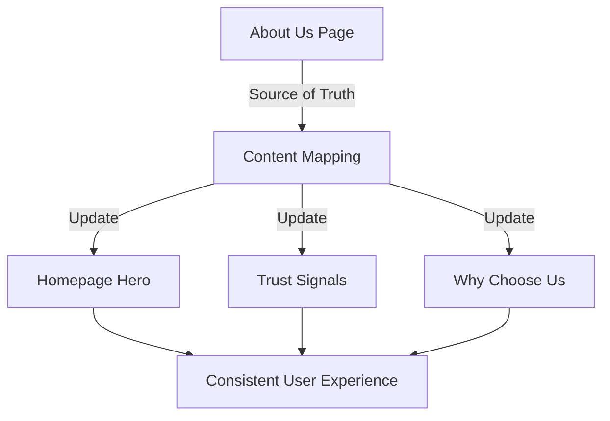
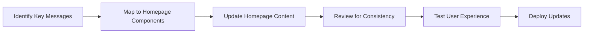

# Design Document: Homepage-About Content Alignment

## Overview

This design document outlines the approach for ensuring consistent messaging between the homepage and About Us page of the Uncle Sam Junk Removal website. The goal is to create a cohesive brand narrative by aligning key messaging points, company values, service descriptions, and credentials across both pages.

## Architecture

The content alignment will be implemented through targeted updates to specific components on the homepage to match the established content on the About Us page. This approach minimizes changes to the overall site architecture while ensuring messaging consistency.

### Key Components to Modify:

1. **HeroSection.tsx** - Update the hero messaging to align with the company story and mission
2. **EnhancedTrustSignals.tsx** - Ensure trust signals match credentials on the About Us page
3. **WhyChooseUs.tsx** - Align benefits with the "Why Choose Us" section on the About Us page

### Content Source of Truth:

The About Us page will serve as the primary source of truth for company information, with the homepage providing consistent but more concise versions of the same messaging.

## Components and Interfaces

### HeroSection Component

```typescript
// src/components/home/HeroSection.tsx
const HeroSection = () => {
  // Existing component structure remains the same
  // Only content updates will be made to align with About Us page
}
```

**Content Updates:**
- Update hero headline and subheading to align with company mission
- Ensure trust indicators match About Us credentials
- Maintain consistent terminology for service area ("Tri-State area")

### EnhancedTrustSignals Component

```typescript
// src/components/home/EnhancedTrustSignals.tsx
const EnhancedTrustSignals = () => {
  // Existing component structure remains the same
  // Only content updates will be made to align with About Us page
}
```

**Content Updates:**
- Ensure veteran-owned messaging matches About Us description
- Align founding date references with About Us page (founded in 2025)
- Update service commitments to match About Us page

### WhyChooseUs Component

```typescript
// src/components/home/WhyChooseUs.tsx
const WhyChooseUs = () => {
  // Existing component structure remains the same
  // Only content updates will be made to align with About Us page
}
```

**Content Updates:**
- Align benefits description with "Why Choose Us" section on About Us page
- Ensure environmental responsibility messaging is consistent
- Match company values with those listed on About Us page

## Data Models

No new data models are required for this feature. The implementation will use existing component structures and only update content.

### Content Mapping

We will create a content mapping between the About Us page and homepage to ensure consistency:

| About Us Content | Homepage Component | Update Required |
|------------------|-------------------|----------------|
| Company founding story | HeroSection | Update subheading to mention veteran-founded |
| Mission statement | HeroSection | Align with mission on About Us |
| Core values (Integrity, Respect, Responsibility) | WhyChooseUs | Ensure values are reflected |
| Veteran-owned status | EnhancedTrustSignals | Match exact description |
| Environmental commitment | HeroSection, WhyChooseUs | Consistent eco-friendly messaging |
| Service area (Tri-State) | All components | Consistent terminology |
| Founded in 2025 | EnhancedTrustSignals | Consistent founding date |
| Service commitments | WhyChooseUs | Match service promises |

## Error Handling

Since this feature involves content updates rather than functional changes, traditional error handling is not applicable. However, we will implement the following safeguards:

1. **Content Review Process** - All content changes will be reviewed to ensure they maintain the intended meaning while achieving consistency
2. **Terminology Standardization** - Create a list of standardized terms to be used consistently across both pages
3. **Visual Verification** - Ensure that content updates do not cause layout issues or visual inconsistencies

## Testing Strategy

### Content Consistency Testing

1. **Manual Review** - Compare each updated section with its corresponding About Us content
2. **Terminology Check** - Verify consistent use of key terms (e.g., "Tri-State area", "veteran-owned", founding date)
3. **Message Alignment** - Ensure core messages about company values, mission, and services are consistent

### Visual Testing

1. **Responsive Testing** - Verify that content updates maintain proper display across all device sizes
2. **Layout Verification** - Ensure content changes do not cause overflow or layout issues

### User Experience Testing

1. **Navigation Flow** - Test the user journey from homepage to About Us page to ensure a coherent narrative
2. **Information Hierarchy** - Verify that the homepage provides appropriate previews of detailed About Us content

## Implementation Considerations

### Content Update Approach

1. **Minimal Code Changes** - Focus on content updates rather than structural changes
2. **Preserve Component Functionality** - Maintain all existing component behaviors and interactions
3. **SEO Considerations** - Ensure content updates maintain or improve SEO value through consistent messaging

### Future Maintenance

To ensure ongoing content consistency:

1. **Single Source of Truth** - Establish the About Us page as the authoritative source for company information
2. **Content Update Process** - Create a process for updating both pages when company information changes
3. **Regular Audits** - Schedule periodic reviews to ensure content remains aligned

## Design Decisions and Rationales

### Decision: Use About Us as Source of Truth

**Rationale:** The About Us page contains the most comprehensive and detailed company information, making it the logical source of truth for company messaging.

### Decision: Update Content Without Structural Changes

**Rationale:** Modifying only the content preserves the existing user experience and functionality while achieving messaging consistency.

### Decision: Focus on Key Messaging Points

**Rationale:** Prioritizing core company values, credentials, and service descriptions ensures the most important brand elements are consistent across pages.

## Diagrams

### Content Flow Diagram



### Content Alignment Process



## Conclusion

This design focuses on creating a cohesive brand narrative by ensuring consistent messaging between the homepage and About Us page. By aligning key content points while preserving the existing component structure, we can improve the user experience and strengthen brand trust without requiring significant code changes.