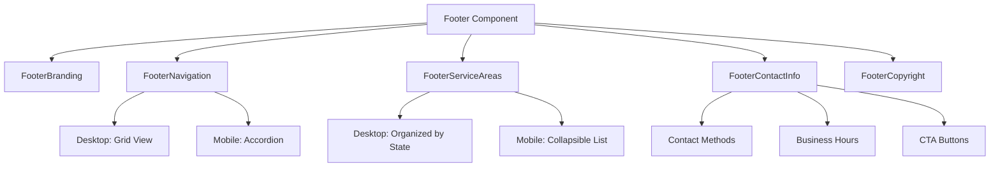

# Design Document: Modern Footer Redesign

## Overview

This design document outlines the approach for implementing a modern, simplified footer for the website. The redesign aims to create a cleaner, more visually appealing footer that maintains all existing functionality while improving the user experience across all devices.

## Architecture

The footer will maintain its position as a global component rendered at the bottom of every page. It will continue to use React and Tailwind CSS for implementation, with the following architectural considerations:

1. **Component Structure**: The footer will be structured as a main component with logical sub-components to improve maintainability.
2. **Responsive Design**: The design will use a mobile-first approach with appropriate breakpoints for different device sizes.
3. **Data Fetching**: The existing data fetching logic will be preserved but optimized for performance.

## Components and Interfaces

### Main Footer Component

The main Footer component will serve as the container for all footer content and will be responsible for:
- Managing the overall layout and responsive behavior
- Handling data fetching for dynamic content
- Managing mobile accordion state

```typescript
// Component signature remains the same
const Footer: React.FC = () => {
  // Implementation details
}
```

### Sub-Components

To improve maintainability, the footer will be divided into these logical sections:

1. **FooterBranding**: Logo and social media links
2. **FooterNavigation**: Site navigation links organized by category
3. **FooterServiceAreas**: Service locations with optimized display
4. **FooterContactInfo**: Contact information and business hours
5. **FooterCopyright**: Copyright information and legal links

Each sub-component will receive only the props it needs, improving component isolation and testability.

## Visual Design

### Layout

The footer will use a grid-based layout with the following characteristics:

1. **Desktop**: Four-column grid layout with clear visual separation between sections
2. **Tablet**: Two-column grid that reorganizes content for medium screens
3. **Mobile**: Single-column layout with expandable/collapsible sections

### Color Scheme

The footer will maintain the brand's color identity while introducing subtle modernizations:

- **Background**: Maintain the brand-navy background but with a subtle gradient or texture for added depth
- **Text**: Improved contrast ratios for better readability
- **Accents**: Strategic use of brand-red for important elements and calls-to-action
- **Dividers**: Subtle, lighter dividers between sections for visual separation

### Typography

- **Headings**: Slightly larger, more prominent section headings with increased font weight
- **Body Text**: Optimized for readability with appropriate line height and letter spacing
- **Links**: Clear visual distinction for interactive elements

### Visual Elements

- **Logo**: Maintain current logo but with improved positioning and spacing
- **Social Icons**: Modern, consistent icon style with subtle hover effects
- **Buttons**: Refined button styling with appropriate padding and hover states
- **Spacing**: Increased whitespace between elements for a cleaner, more modern feel

## Mobile Experience

The mobile footer will be significantly improved with:

1. **Accordion Sections**: Refined expandable/collapsible sections with smooth animations
2. **Touch Targets**: Enlarged interactive areas for better touch interaction
3. **Visual Indicators**: Clear visual cues for expandable sections
4. **Vertical Spacing**: Optimized spacing to reduce unnecessary scrolling



## Data Models

The footer will continue to use the existing data models:

1. **Social Links**:
```typescript
interface SocialLinks {
  facebook: string;
  instagram: string;
  twitter: string;
  linkedin: string;
}
```

2. **Contact Information**:
```typescript
interface ContactInfo {
  phone: string;
  email: string;
  hours: string;
}
```

3. **Business Hours**:
```typescript
interface BusinessHours {
  weekday: string;
  weekend: string;
}
```

4. **Service Areas**:
```typescript
interface ServiceArea {
  state: string;
  cities: string[];
}
```

## State Management

The footer will maintain the following state:

1. **Mobile Accordion State**: Track which sections are expanded on mobile
2. **Loading States**: Track loading status for dynamic data
3. **Error States**: Handle and display appropriate error messages when data fetching fails

## Error Handling

1. **Data Fetching Errors**: Graceful fallback to default values when API calls fail
2. **Loading States**: Clear visual indicators during data loading
3. **Missing Data**: Appropriate handling of missing or incomplete data

## Testing Strategy

1. **Unit Tests**: Test individual sub-components in isolation
2. **Integration Tests**: Test the footer as a whole with mocked data
3. **Responsive Testing**: Verify layout and behavior across different screen sizes
4. **Accessibility Testing**: Ensure the footer meets WCAG 2.1 AA standards

## Performance Considerations

1. **Code Splitting**: Consider lazy loading for non-critical footer elements
2. **Optimized Rendering**: Minimize unnecessary re-renders
3. **Image Optimization**: Ensure logo and icons are properly optimized
4. **Animation Performance**: Use CSS transitions instead of JavaScript for animations when possible

## Accessibility Improvements

1. **Keyboard Navigation**: Ensure all interactive elements are keyboard accessible
2. **Screen Reader Support**: Proper ARIA attributes and semantic HTML
3. **Color Contrast**: Meet WCAG 2.1 AA contrast requirements
4. **Focus Indicators**: Clear visual focus indicators for keyboard users